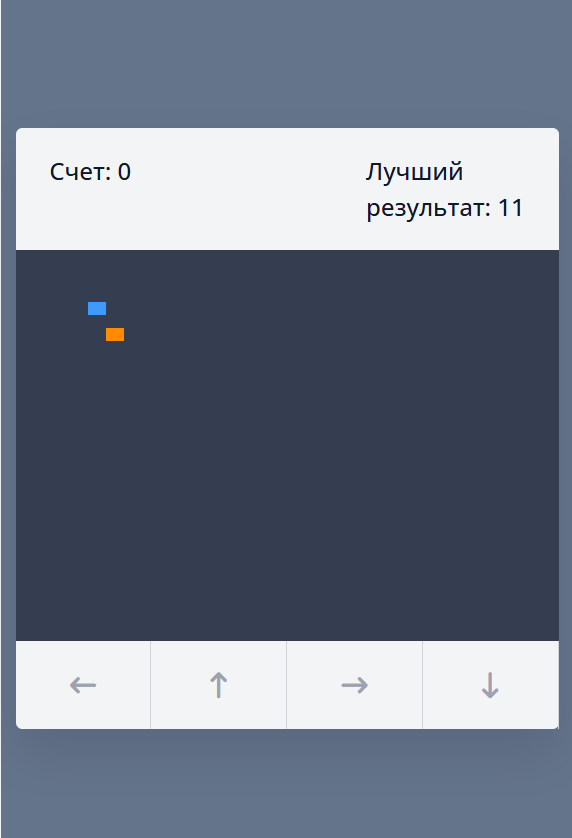

# Snake Game — Змейка на JavaScript

Браузерная игра «Змейка» на чистом JavaScript без фреймворков и библиотек.



## Геймплей

- Управление стрелками на клавиатуре
- Змейка растёт при поедании еды
- Столкновение со стенами или собой — конец игры
- Подсчёт текущего счёта
- Сохранение лучшего результата

## Стек

- HTML
- CSS
- JavaScript (vanilla)

## Запуск

Никаких зависимостей и сборки не требуется — открыть `index.html` в браузере.

```bash
git clone https://github.com/zxy11636/snake-game.git
cd snake-game
# Открыть index.html в браузере
```

## Структура

```
snake-game/
├── css/
│   └── style.css     # Стили игрового поля
├── img/              # Изображения
├── js/
│   └── script.js     # Логика игры
├── index.html        # Точка входа
└── favicon.ico
```

## Автор

**Матвей Семахин** — [Telegram](https://t.me/tutaNETU) · [Email](mailto:prodzxy@mail.ru)
